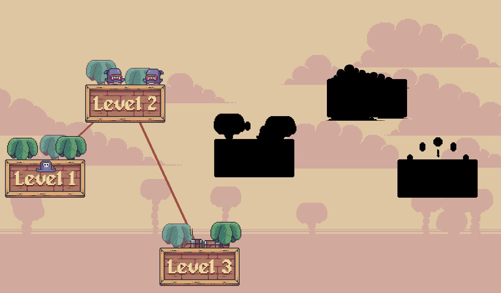
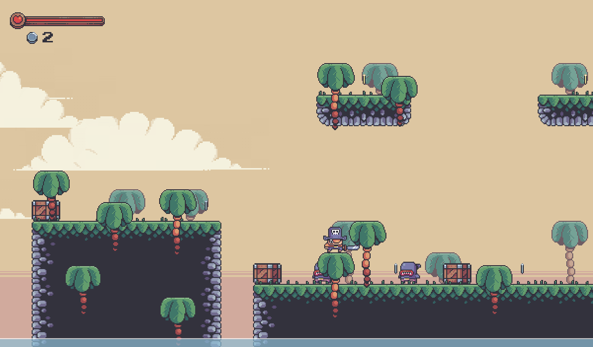

## description

congenial is a game bored based game like mario bros. i create this game because i cannot sleep well, 
so i create this game for make me sleep well.






## installation

minimum requirement for play congenial
- python 3.6.0 with pip latest version installed

**windows**

```
pip install pygame
# or
py -m pip install pygame
# and launch the game
py main.py
```

**linux**
```
pip install pygame
# or
python -m pip install pygame
# and launch the game
python main.py
```

## function

```
left arrow = walk left
space = jump
right arrow = walk right
```

ready to enjoy my bored game
